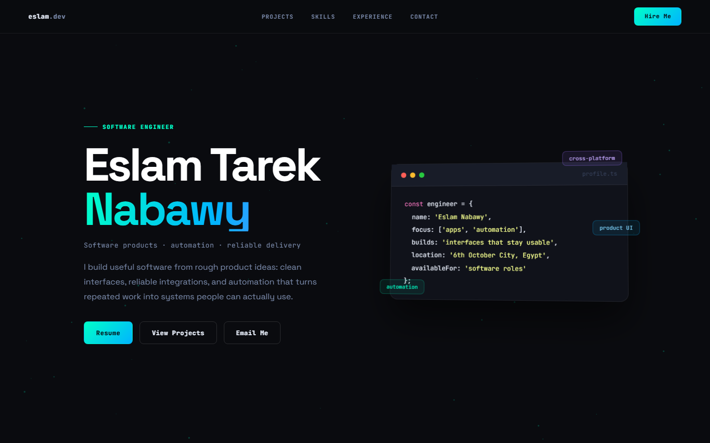

## Start Here

  

  <strong>Flutter Software Engineer</strong> 
  I build cross-platform apps, local-first desktop systems, real-time communication tools, and AI automation workflows.

  <a href="https://eslamnabawy.github.io/Nabawy-s-Portfolio-/"><strong>Portfolio</strong></a>
  ·
  <a href="https://github.com/EslamNabawy/EslamNabawy/raw/main/assets/eslam-tarek-nabawy-resume-2026.pdf">Resume</a>
  ·
  <a href="https://www.linkedin.com/in/eslam-tarek-nabawy/">LinkedIn</a>
  ·
  <a href="mailto:eslamtarek.dev@gmail.com">Email</a>
  ·
  <a href="https://wa.me/201015683693">WhatsApp</a>

The portfolio gives a visual overview of my work: product scope, technical decisions, shipped Flutter systems, and delivery practices.

---

## What I Build

<table>
  <tr>
    <td width="50%">
      <strong>Cross-platform Flutter apps</strong> 
      Android and Windows apps with clean architecture, responsive UI, Firebase, REST APIs, and maintainable state management.
    </td>
    <td width="50%">
      <strong>Local-first desktop systems</strong> 
      Offline-capable Windows tools with local persistence, release workflows, diagnostics, tests, and CI/CD.
    </td>
  </tr>
  <tr>
    <td width="50%">
      <strong>Real-time communication</strong> 
      WebRTC messaging, file transfer, voice/video calls, Firebase signaling, connection recovery, and access controls.
    </td>
    <td width="50%">
      <strong>AI automation workflows</strong> 
      n8n pipelines using OpenAI, Claude, webhooks, routing logic, notifications, and error-aware execution.
    </td>
  </tr>
</table>

---

## How I Work

<table>
  <tr>
    <td width="50%">
      <strong>Product thinking</strong> 
      I focus on workflows, constraints, failure cases, and what the user actually needs to finish the job.
    </td>
    <td width="50%">
      <strong>Clear architecture</strong> 
      I separate UI, state, data, routing, persistence, and integrations so the codebase can grow without becoming fragile.
    </td>
  </tr>
  <tr>
    <td width="50%">
      <strong>Reliable delivery</strong> 
      I care about tests, release artifacts, diagnostics, documentation, and GitHub Actions workflows.
    </td>
    <td width="50%">
      <strong>Practical automation</strong> 
      I use AI and workflow tools where they remove repeated work, improve routing, or make operations easier to run.
    </td>
  </tr>
</table>

---

## Engineering Strengths

- Turning rough product ideas into usable shipped software.
- Structuring Flutter codebases around features, clear state boundaries, and testable data flows.
- Designing local persistence and offline behavior for desktop/mobile apps.
- Integrating Firebase, REST APIs, WebRTC, and automation services without hiding complexity.
- Keeping delivery practical: release artifacts, documentation, CI/CD, and maintainable codebase structure.

---

## Toolbox

**Flutter:** Dart, Flutter Desktop, Android, BLoC, Cubit, Riverpod, GoRouter, responsive UI

**Data:** Firebase Auth, Firestore, Realtime Database, Storage, Remote Config, Drift, Hive, SQL, NoSQL

**Automation:** n8n, OpenAI API, Claude API, webhooks, REST APIs, prompt engineering

**Delivery:** Git, GitHub, GitHub Actions, CI/CD, unit testing, Figma, Docker, AWS

---

## Contact

- Portfolio: [eslamnabawy.github.io/Nabawy-s-Portfolio-](https://eslamnabawy.github.io/Nabawy-s-Portfolio-/)
- Resume: [Download PDF](https://github.com/EslamNabawy/EslamNabawy/raw/main/assets/eslam-tarek-nabawy-resume-2026.pdf)
- LinkedIn: [linkedin.com/in/eslam-tarek-nabawy](https://www.linkedin.com/in/eslam-tarek-nabawy/)
- Email: [eslamtarek.dev@gmail.com](mailto:eslamtarek.dev@gmail.com)
- WhatsApp: [+20 101 568 3693](https://wa.me/201015683693)
