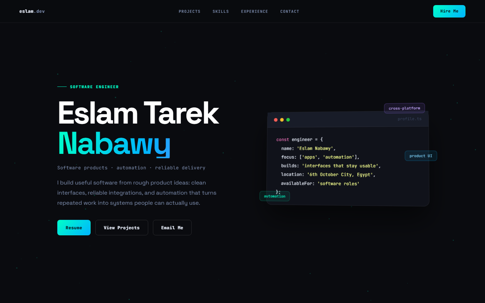

## Portfolio

  

  <strong>Software Engineer | DevOps, AIOps & Automation</strong> 
  I build AI-assisted operations workflows and production software: Linux, Docker, Kubernetes, CI/CD,
  observability, Python, n8n, and multi-provider LLMs.

  <a href="https://eslamnabawy.github.io/Nabawy-s-Portfolio-/"><strong>Portfolio</strong></a>
  ·
  <a href="https://github.com/EslamNabawy/EslamNabawy/raw/main/assets/eslam-tarek-nabawy-resume-2026.pdf">Resume</a>
  ·
  <a href="https://www.linkedin.com/in/eslam-tarek-nabawy/">LinkedIn</a>
  ·
  <a href="mailto:eslamtarek.dev@gmail.com">Email</a>
  ·
  <a href="https://wa.me/201015683693">WhatsApp</a>

---

## Summary

Software engineer transitioning into DevOps and AIOps, with hands-on experience in Linux, Docker, Kubernetes, CI/CD, observability, and automation. Builds AI-assisted operations workflows with Python, n8n, Ollama, and multi-provider LLMs, with a current focus on root cause analysis and anomaly-driven operations. Completing the 420-hour NTI AIOps Engineer Track while building an AIOps capstone that injects Kubernetes faults, collects resulting telemetry, and evaluates AI-generated root cause analysis against known ground truth. Brings end-to-end software delivery experience across cross-platform applications, automation systems, and SaaS products.

---

## Selected Projects

<table>
  <tr>
    <td width="50%">
      <strong>Chaos-Grounded Autonomous AIOps Platform</strong> 
      NTI AIOps capstone: injects faults into Kubernetes to create ground-truth incidents, correlates the resulting alerts, and uses an AI agent to investigate metrics and logs for root cause analysis. The AI-generated RCA is scored against the injected fault, so the system is measurable rather than purely demonstrative. Runs the cluster, observability stack, and self-hosted LLMs through Ollama on a single WSL2 machine — no paid APIs, no telemetry leaving the environment.
    </td>
    <td width="50%">
      <strong>FairMatch: Automated Fair Team Formation</strong> 
      n8n workflow that partitions a 24-person cohort into 4 balanced teams of 6 using multi-objective lexicographic optimization. Three-stage pipeline for cleaning, solving, and publishing with deduplication, peer-consensus imputation, rating-scale detection, and rater-consistency auditing. 20 multi-start solver runs achieved an inter-team skill gap of 0.19 or less, zero hard-constraint violations, and the required gender distribution — verified against a Python reference implementation.
    </td>
  </tr>
  <tr>
    <td width="50%">
      <strong>Omnichannel AI Support</strong> 
      AI customer-service platform that responds automatically on WhatsApp and Telegram with a Supabase memory layer, multi-provider routing and automatic failover across Groq, Gemini, and OpenRouter, and a safety gate that validates every AI response before delivery.
    </td>
    <td width="50%">
      <strong>DevOps Library</strong> 
      Structured DevOps learning platform covering Linux, Terraform, CI/CD, Kubernetes, Docker, and Ansible, with practical guides, documentation, and downloadable resources organized into technology tracks.
      <a href="https://eslamnabawy.github.io/DevOps-By-Nabawy">Live</a>
    </td>
  </tr>
  <tr>
    <td width="50%">
      <strong>Brox: Workspace Operations & BI Platform</strong> 
      Coworking-space SaaS in Flutter covering customers, reservations, memberships, finance, inventory, staff, analytics, role-based access control, customer segmentation, loyalty scoring, and a recommendation engine, with GitHub Actions CI/CD.
    </td>
    <td width="50%">
      <strong>Rain: Peer-to-Peer Communication Platform</strong> 
      Private Android/Windows platform for peer-to-peer messaging, file transfer, and voice/video calls over WebRTC with encrypted signaling, offline-first Drift persistence, connection diagnostics, and a Melos monorepo with GitHub Actions CI/CD.
    </td>
  </tr>
</table>

---

## Toolbox

**DevOps & Infrastructure:** Linux, Docker, Kubernetes, WSL2, Terraform (fundamentals), Git, GitHub Actions, CI/CD, GitHub CLI

**Observability & AIOps:** Prometheus, Grafana, alerting, alert correlation, root cause analysis, anomaly detection, chaos engineering

**AI & Automation:** Python, LLM integration, Ollama, LangGraph, n8n, webhooks, multi-provider AI orchestration (OpenAI, Claude, Groq, Gemini, OpenRouter)

**Backend & Data:** PostgreSQL, Supabase (Edge Functions), Firebase, REST APIs, SQL, SQLite, Drift, Hive, NoSQL, Google Sheets API, data modeling

**Software Engineering:** JavaScript, Dart, Flutter, software architecture, clean code, OOP, design patterns, data structures & algorithms, Melos monorepo

---

## Education

**Bachelor of Computer Science** — Akhbar El-Yom Academy, 6th October City
Oct 2020 – Jul 2024 · Grade 90.40% · Ranked 9th in class
Graduation project: CampusSuit, a university academic management system (Excellent grade).

---

## Certifications & Training

**AIOps Engineer Track (I021)** — National Telecommunication Institute (NTI) · 420 hours · Jul 2026 – Present
AIOps platforms, Kubernetes and cloud observability, ML-based anomaly detection, SRE practices, communication, leadership, presentation, and project management.

---

## Leadership & Community

- **Flutter Head, Google Developer Student Clubs (GDSC)** — Oct 2022 – Oct 2023: led the Flutter team, delivered sessions on Flutter, application architecture, and state management, co-organized NextGen and Google I/O Extended.
- **Core Team Member, ICPC Collegiate Programming** — Jun 2020 – Oct 2023: organized university programming contests and coached participants in data structures, algorithms, and problem solving.

---

## Contact

- Portfolio: [eslamnabawy.github.io/Nabawy-s-Portfolio-](https://eslamnabawy.github.io/Nabawy-s-Portfolio-/)
- Resume: [Download PDF](https://github.com/EslamNabawy/EslamNabawy/raw/main/assets/eslam-tarek-nabawy-resume-2026.pdf)
- LinkedIn: [linkedin.com/in/eslam-tarek-nabawy](https://www.linkedin.com/in/eslam-tarek-nabawy/)
- GitHub: [github.com/EslamNabawy](https://github.com/EslamNabawy)
- Email: [eslamtarek.dev@gmail.com](mailto:eslamtarek.dev@gmail.com)
- WhatsApp: [+20 101 568 3693](https://wa.me/201015683693)

Languages: Arabic (Native) · English (Upper-Intermediate) · Military status: Completed
